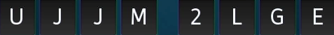

# OCR Tips

Tesseract is the open-source Optical Character Recognition (OCR) engine that
stb-tester uses to read text from images. `stbt.ocr` allows you to customise
tesseract's parameters; this document contains advice for improving tesseract's
accuracy in specific scenarios.

Tesseract is optimised for reading pages of prose, so it doesn't always yield
good results when reading the rather disjointed text typical of a graphical
user interface.

Tesseract uses a dictionary to help choose the correct word even if individual
characters were misread. This is helpful when reading real words but it can get
in the way when reading characters and words with a different structure.

## Matching serial numbers

For example, here is a code generated at random by one user's set-top box, for
the purpose of pairing with a second-screen device:

    >>> import cv2, stbt
    >>> ujjm2lge = cv2.imread("../tests/ocr/UJJM2LGE.png")

The code consists of 8 characters randomly chosen from the upper case letters
and the digits. Tesseract is not expecting this and we need to give it some
help to recognise any characters at all:

    >>> stbt.ocr(frame=ujjm2lge)
    u''

The parameter `mode` is useful in this situation. This controls tesseract's
segmentation -- how tesseract expects the text to be laid out in the image. The
default `OcrMode.PAGE_SEGMENTATION_WITHOUT_OSD` tells tesseract to expect a
page of text. In this case we are expecting a single string so we try
`OcrMode.SINGLE_WORD`:

    >>> stbt.ocr(frame=ujjm2lge, mode=stbt.OcrMode.SINGLE_WORD)
    u'UJJMZLGE'

Close, but no cigar (tesseract read the "2" as a "Z"). Tesseract thinks that a
word with a 2 in the middle is unlikely. We can tell tesseract to expect an
8-character word consisting of letters or digits, by specifying
`tesseract_user_patterns`:

    >>> stbt.ocr(frame=ujjm2lge, mode=stbt.OcrMode.SINGLE_WORD,
    ...          tesseract_user_patterns=[r'\n\n\n\n\n\n\n\n'])
    u'UJJM2LGE'

Success.

Unfortunately the [tesseract pattern language][patterns] is a little
idiosyncratic. It looks a little like regular expressions but is incompatible
and much more limited. The only documentation is in a header file in the
tesseract sources. Very roughly regexes and tesseract patterns match up like
this:

| tesseract | regex         |
|-----------|---------------|
| `\c`      | `[a-zA-Z]`    |
| `\d`      | `[0-9]`       |
| `\n`      | `[a-zA-Z0-9]` |
| `\p`      | `[:punct:]`   |
| `\a`      | `[a-z]`       |
| `\A`      | `[A-Z]`       |
| `\*`      | `*`           |

**Note:** `tesseract_user_patterns` requires tesseract 3.03 or later.

[patterns]: https://code.google.com/p/tesseract-ocr/source/browse/trunk/dict/trie.h?r=714#167
